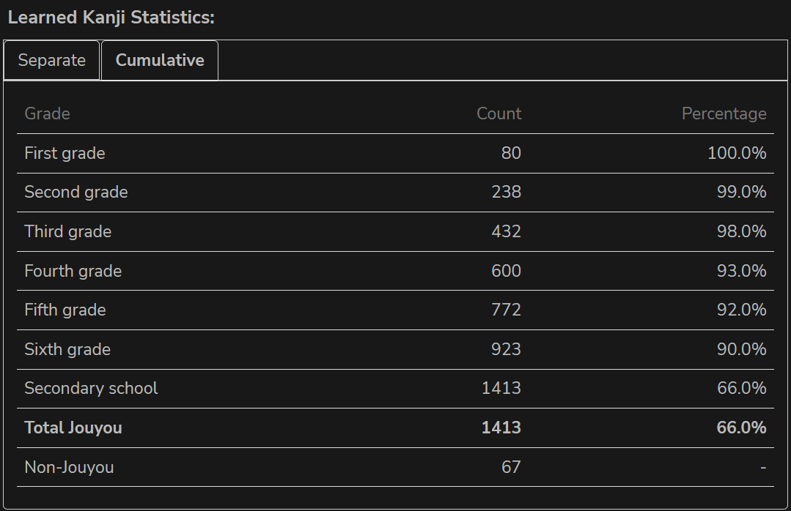
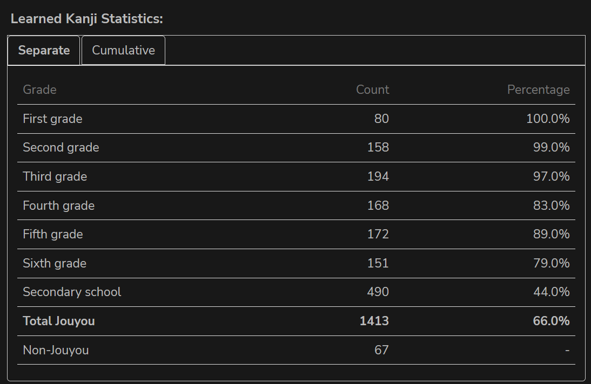

# JPDB-Kanji-Count

A Tampermonkey userscript that enhances the [JPDB.io](https://jpdb.io) "Wall of Kanji" page by displaying statistics about your known kanji, categorized by Japanese school grade levels.

## Features

- Counts known kanji by grade level (1st through 6th grade, plus secondary school)
- Displays the percentage of kanji learned in each category
- Shows total jouyou kanji learned and overall completion percentage
- Counts non-jouyou kanji learned

## Screenshot

### Cumulative Statistics

### Independent Statistics

## Installation

1. Install the [Tampermonkey](https://www.tampermonkey.net/) browser extension:
   - [Chrome](https://chrome.google.com/webstore/detail/tampermonkey/dhdgffkkebhmkfjojejmpbldmpobfkfo)
   - [Firefox](https://addons.mozilla.org/en-US/firefox/addon/tampermonkey/)
   - [Edge](https://microsoftedge.microsoft.com/addons/detail/tampermonkey/iikmkjmpaadaobahmlepeloendndfphd)
   - [Safari](https://apps.apple.com/app/tampermonkey/id1482490089)

2. Click on this link to install the script (or copy the script content and create a new script in Tampermonkey):
   - (Add direct installation link if available)

3. Alternatively, you can manually install by:
   - Opening Tampermonkey dashboard
   - Creating a new script
   - Copying the contents of the "Kanji count.js" file
   - Saving the script

## Usage

1. Visit the [JPDB Wall of Kanji page](https://jpdb.io/labs/wall-of-kanji)
2. The script will automatically run and display statistics about your known kanji
3. Statistics will appear in a box below the "Wall of kanji" heading

## License

This project is licensed under the MIT License - see the [LICENSE](LICENSE) file for details.

## Author

- Sacus
